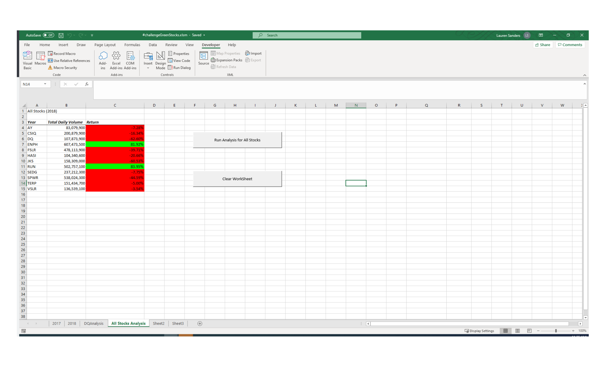

# Stock-Analysis
>Provided a worksheet utilizing VBA Arrays, where 12 stocks can be analyzed by Ticker Index for years 2017 and 2018 with the click of a button. It will return total daily volume and annual return for each ticker index. The spreadsheet can be cleared and re-ran as needed for data sets. See image below 

  
